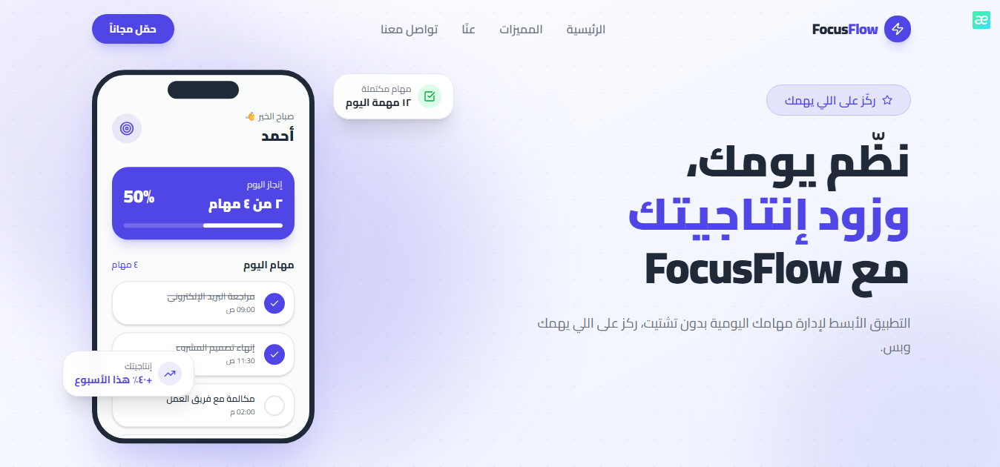

# FocusFlow

A responsive Arabic landing page for a task-management and productivity app.

FocusFlow presents the app's value proposition, core productivity concepts, and a simple contact experience through a clear, modern interface.



## Features

- Responsive design for mobile, tablet, and desktop
- Arabic right-to-left (RTL) layout support with localized routing
- Modern landing page UI with hero, features, about, and contact sections
- Smooth reveal animations
- Client-side contact form validation and success feedback
- SEO metadata, Open Graph image, `robots.txt`, and sitemap setup

## Tech Stack

- Next.js
- React
- Tailwind CSS
- shadcn/ui
- Motion
- next-intl
- Lucide React

## Project Structure

```text
app/          Pages, layouts, and SEO routes
components/   Layout, section, UI, and animation components
i18n/         Locale routing and configuration
lib/          Site configuration, utilities, and validation
messages/     Translation messages
public/       Static assets
styles/       Global styles
```

## Getting Started

```bash
npm install
npm run dev
```

## Live Demo

[https://focusflow-lyart-kappa.vercel.app/](https://focusflow-lyart-kappa.vercel.app/)
